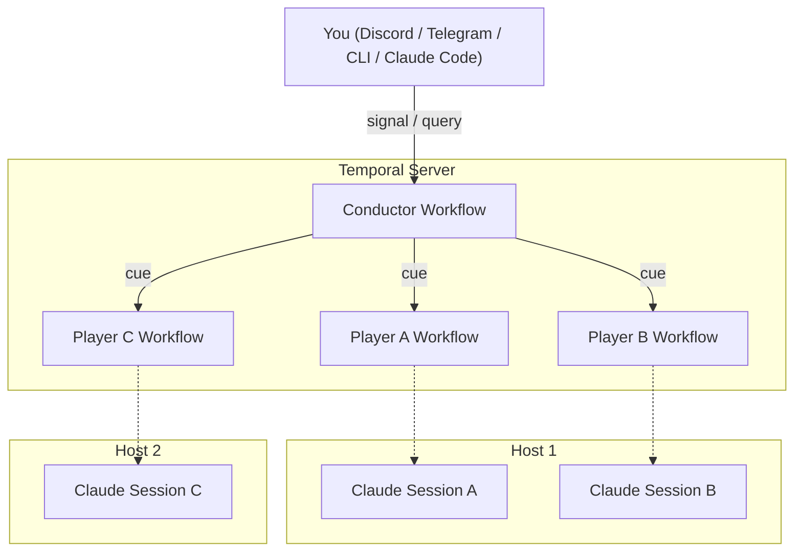

# claude-tempo

MCP server for multi-session Claude Code coordination via [Temporal](https://temporal.io).

Multiple Claude Code sessions discover each other, exchange messages in real time, and coordinate work — across machines, not just localhost.

Inspired by [claude-peers](https://github.com/louislva/claude-peers-mcp) and seeing how it interacted with Claude Code's experimental channel capability. claude-tempo takes the concept further with Temporal as the coordination backbone — adding durable state, cross-machine messaging, structured orchestration, and automatic stale session cleanup.

## How it works

**claude-tempo** uses Temporal workflows as the coordination layer:

- Each Claude Code session registers as a **player** (a Temporal workflow)
- Players belong to an **ensemble** — a named group of sessions that can see and message each other
- Players discover each other via `ensemble`, message via `cue`, and spawn new sessions via `recruit`
- Players can interact directly (peer-to-peer) — no central hub required
- An optional **conductor** player acts as an orchestration hub for the ensemble, connected to external interfaces like Discord or Telegram

### Ensembles

An **ensemble** is an isolated group of players identified by name (e.g., `frontend`, `backend`, `default`). Players in one ensemble cannot see or message players in another — they are completely independent.

Each ensemble can have:
- Any number of **players** working on tasks
- One optional **conductor** coordinating work and connected to external interfaces

By default, all sessions join the `default` ensemble. Pass an ensemble name when starting a session to create or join a different one:

```bash
claude-tempo conduct frontend     # conduct the "frontend" ensemble
claude-tempo start backend        # join the "backend" ensemble
claude-tempo conduct              # conduct the "default" ensemble
```

This lets you run separate groups of sessions for different projects or concerns without interference.



## Tools

| Tool | Description |
|------|-------------|
| `ensemble` | Discover active sessions in your ensemble. Scope: `machine`, `repo`, `all`. |
| `cue` | Send a message to any session by player name. Instant via Temporal signal. |
| `set_name` | Set a human-readable name for this session. Used by other players to message you. |
| `set_part` | Describe what you're working on. Visible to others via `ensemble`. |
| `listen` | Manual fallback for checking pending messages. |
| `recruit` | Start a named Claude Code session in a directory. Opens a new terminal window automatically. |
| `report` | Send updates to the conductor (surfaces to Discord/Telegram). No-op if no conductor. |
| `terminate` | Terminate a player session by name. Use to clean up orphaned sessions. |

## Prerequisites

- [Node.js](https://nodejs.org/) 18+
- [Temporal CLI](https://docs.temporal.io/cli) (for local dev server)
- [Claude Code](https://claude.ai/code)

## Quick start

The fastest way to get going — one command handles everything:

```bash
# Install
npm install -g claude-tempo

# Go to your project and run `up`
cd your-project
claude-tempo up
```

`claude-tempo up` will:
1. Check that the Temporal CLI is installed
2. Start the Temporal dev server if it's not already running (data persists in `~/.claude-tempo/`)
3. Register the required search attributes automatically
4. Create `.mcp.json` in your project if it doesn't exist
5. Launch a conductor session in a new terminal window

After `up` completes, you're ready to add players:

```bash
claude-tempo start          # open a player session
claude-tempo status         # see who's active
```

Or ask the conductor to `recruit` players for you from inside Claude Code.

### Manual setup

If you prefer more control, you can run each step individually:

```bash
# Start Temporal dev server (keep this running)
claude-tempo server

# In your project directory, create .mcp.json
cd your-project
claude-tempo init

# Verify everything is ready
claude-tempo preflight

# Start a conductor
claude-tempo conduct

# Add players
claude-tempo start
```

## CLI

The `claude-tempo` CLI handles setup, session management, and diagnostics.

### Commands

| Command | Description |
|---------|-------------|
| `up [ensemble]` | First-time setup: start Temporal, configure MCP, launch conductor |
| `down` | Stop Temporal, terminate sessions, remove MCP config |
| `server` | Start the Temporal dev server and register search attributes |
| `conduct [ensemble]` | Start a conductor session (one per ensemble) |
| `start [ensemble]` | Start a player session |
| `status [ensemble]` | Show active sessions and Temporal health |
| `init` | Create `.mcp.json` config in the current directory |
| `preflight` | Run environment checks only |
| `help` | Show usage info |

### Options

```
--temporal-address <addr>   Temporal server address (default: localhost:7233)
-n, --name <name>           Set the player name for the session (start/conduct/up)
--skip-preflight            Skip preflight checks (start/conduct)
--background, -d            Run Temporal in background (server only)
--dir <path>                Target directory for init (default: cwd)
```

### `up` — first-time setup

`claude-tempo up` is the recommended way to get started. It handles everything in order:

```
$ claude-tempo up myband

claude-tempo setup
  pass temporal CLI installed
  ... Starting Temporal dev server...
  pass Temporal started (pid 12345, data in ~/.claude-tempo/)
  ok Registered search attribute: ClaudeTempoHostname
  ok Registered search attribute: ClaudeTempoGitRoot
  ok Registered search attribute: ClaudeTempoEnsemble
  ok Registered search attribute: ClaudeTempoPlayerId
  pass .mcp.json created

Launching conductor in ensemble myband...

ok You're all set!
  Conductor launched (pid 12346)
  Ensemble: myband

  What next?
  claude-tempo start myband    Add a player session
  claude-tempo status myband   See who's active
  Or ask the conductor to recruit players for you
```

### `server` — Temporal management

`claude-tempo server` starts the Temporal dev server with automatic search attribute registration:

```bash
claude-tempo server                 # foreground (Ctrl+C to stop)
claude-tempo server --background    # daemonize
claude-tempo server -d              # shorthand
```

- Stores data in `~/.claude-tempo/temporal-data.db` (persists across restarts)
- Registers all required search attributes automatically
- If Temporal is already running, just registers attributes and exits

### `init` — MCP configuration

`claude-tempo init` creates a `.mcp.json` in the current directory (or merges into an existing one):

```json
{
  "mcpServers": {
    "claude-tempo": {
      "command": "npx",
      "args": ["claude-tempo-server"]
    }
  }
}
```

Uses `npx` to resolve the server binary, so it works regardless of PATH configuration.

### `status` — ensemble overview

`claude-tempo status` shows all active sessions:

```
Ensemble: myband
  3 active sessions

  conductor (conductor)
    Orchestrating the team
    /Users/me/projects/app  main  my-machine.local

  alice
    Building the REST endpoints
    /Users/me/projects/app  feat/api  my-machine.local

  bob
    Working on the dashboard
    /Users/me/projects/app  feat/ui  my-machine.local
```

### `preflight` — environment checks

`claude-tempo preflight` verifies your environment:

- Node.js >= 18
- Temporal server reachable
- `claude` binary on PATH
- `claude-tempo-server` binary on PATH
- `.mcp.json` configured in the current directory

## Starting a conductor

A **conductor** is an optional special player that acts as an orchestration hub for the ensemble. Use a conductor when you want:

- A single session coordinating work across multiple players
- External access to the ensemble via Discord, Telegram, or any Temporal client
- A central point for players to `report` progress, blockers, and questions

Without a conductor, players still work fine — they discover each other via `ensemble` and communicate directly via `cue`. The conductor is a hub, not a gatekeeper.

There is one conductor per ensemble. Start one with:

```bash
claude-tempo conduct                # conductor in "default" ensemble
claude-tempo conduct my-project     # conductor in "my-project" ensemble
```

### External access

The conductor's Temporal workflow exposes a signal/query API that anyone can use — no Claude Code session needed:

```typescript
import { Client } from '@temporalio/client';

const client = new Client();
// Conductor workflow ID: claude-session-{ensemble}-conductor
const conductor = client.workflow.getHandle('claude-session-default-conductor');

// Send a command
await conductor.signal('command', {
  text: 'recruit /repos/api and run tests',
  source: 'cli',
});

// Check history of commands and reports
const history = await conductor.query('history');
```

You can also connect external channel plugins (e.g., Discord):

```bash
CLAUDE_TEMPO_CONDUCTOR=true claude \
  --channels plugin:discord@claude-plugins-official \
  --dangerously-skip-permissions --dangerously-load-development-channels server:claude-tempo
```

## Starting players

The recommended way to build an ensemble is to use the CLI to start sessions. Each session opens in a new terminal window with the full shell environment preserved.

```bash
# Terminal 1 — conductor
claude-tempo conduct my-project

# Terminal 2 — frontend player
claude-tempo start my-project -n frontend

# Terminal 3 — backend player
claude-tempo start my-project -n backend
```

Or let the conductor `recruit` players directly — this spawns new terminal windows automatically.

Once sessions are running, try:
- "Show me the ensemble" — discovers other sessions
- "Set your name to 'frontend'" — gives your session a human-readable name
- "Cue frontend: what are you working on?" — sends a message by name

### Terminal support

The `recruit` tool and CLI automatically detect and open sessions in your terminal:

| Terminal | macOS | Linux | Windows |
|----------|-------|-------|---------|
| Ghostty | `initial input` via AppleScript | — | — |
| iTerm2 | `write text` via AppleScript | — | — |
| Terminal.app | `.command` file | — | — |
| gnome-terminal | — | `--` flag | — |
| konsole / xterm | — | `-e` flag | — |
| cmd.exe / PowerShell | — | — | `start` command |

All macOS terminals use approaches that preserve the user's full shell environment (fish, zsh, bash) including node version managers (fnm, nvm).

### Session naming

Sessions start with a random 8-character hex ID. You can set a name at launch with `-n` or use `set_name` inside a session:

- Names are stored as Temporal search attributes (`ClaudeTempoPlayerId`) and updated in-place — no workflow restart needed
- Other players use the name to send messages via `cue` and discover sessions via `ensemble`
- `recruit` automatically tells the new session to set its name
- Names must be unique within an ensemble — `set_name` rejects duplicates
- Names must contain only letters, numbers, hyphens, and underscores

## Configuration

| Environment Variable | Default | Description |
|---------------------|---------|-------------|
| `TEMPORAL_ADDRESS` | `localhost:7233` | Temporal server address |
| `TEMPORAL_NAMESPACE` | `default` | Temporal namespace |
| `CLAUDE_TEMPO_TASK_QUEUE` | `claude-tempo` | Task queue name |
| `CLAUDE_TEMPO_ENSEMBLE` | `default` | Ensemble name (isolates groups of players) |
| `CLAUDE_TEMPO_CONDUCTOR` | `false` | Set to `true` to enable conductor mode |
| `CLAUDE_TEMPO_PLAYER_NAME` | *(random hex)* | Set a player name on startup (used by `-n` flag) |

## Development

```bash
# Clone and install
git clone https://github.com/vinceblank/claude-tempo.git
cd claude-tempo && npm install

# Build (compiles TypeScript and pre-bundles workflow code)
npm run build

# Run MCP server in development
npx ts-node src/server.ts

# Link CLI for local testing
npm link
```

> **Important**: Run `npm run build` after changing workflow code (`src/workflows/`). The build pre-bundles workflows into `workflow-bundle.js` so all workers use identical code.

## Why Temporal?

- **Cross-machine**: Any session that can reach the Temporal server can join the ensemble
- **Instant signaling**: Temporal signals deliver messages between sessions with no broker polling
- **Durable history**: Full audit trail of every message in Temporal's event history
- **No custom infrastructure**: No broker daemon, no database — just Temporal
- **Extensible**: The conductor's signal/query contract is a public API anyone can build on

## Stale session cleanup

When a Claude Code session crashes or is closed without graceful shutdown, its Temporal workflow detects the problem automatically:

- If a message is sent to a dead session and remains undelivered for **3 minutes**, the workflow self-completes
- Before exiting, it notifies the conductor with the undelivered message content so work can be reassigned
- Idle sessions with no pending messages remain running (they aren't hurting anyone) until the 24-hour execution timeout

This means you don't need to manually clean up crashed sessions — just `cue` the dead player and the system handles the rest.

## Known limitations

- **`recruit` requires manual acknowledgment**: Recruited sessions use `--dangerously-load-development-channels` to enable channel-based message delivery. Claude Code shows an interactive confirmation prompt that must be manually acknowledged (press Enter) in the spawned terminal window. This will be resolved once claude-tempo is published as an approved channel plugin.

## License

MIT
