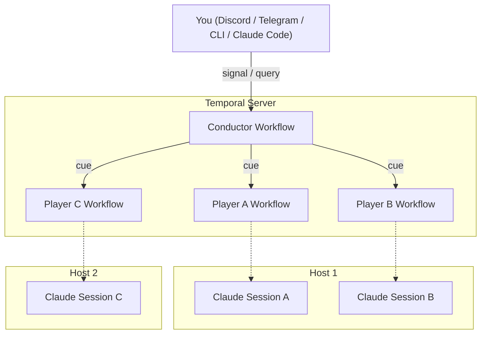

# claude-tempo

MCP server for multi-session Claude Code coordination via [Temporal](https://temporal.io).

Multiple Claude Code sessions discover each other, exchange messages in real time, and coordinate work — across machines, not just localhost.

## How it works

**claude-tempo** uses Temporal workflows as the coordination layer:

- Each Claude Code session registers as a **player** (a Temporal workflow)
- Players discover each other via `ensemble`, message via `cue`, and spawn new sessions via `recruit`
- Players can interact directly (peer-to-peer) — no central hub required
- **Ensembles** are namespaced — run independent groups of players for different projects



## Tools

| Tool | Description |
|------|-------------|
| `ensemble` | Discover active sessions in your ensemble. Scope: `machine`, `repo`, `all`. |
| `cue` | Send a message to any session by player name. Instant via Temporal signal. |
| `set_name` | Set a human-readable name for this session. Used by other players to message you. |
| `set_part` | Describe what you're working on. Visible to others via `ensemble`. |
| `listen` | Manual fallback for checking pending messages. |
| `recruit` | Start a named Claude Code session in a directory. Rejects if the name is already active. **Note:** Recruited sessions require manual acknowledgment of the development channels prompt (see [Known limitations](#known-limitations)). |
| `report` | Send updates to the conductor (surfaces to Discord/Telegram). No-op if no conductor. |
| `terminate` | Terminate a player session by name. Use to clean up orphaned sessions. |

## Prerequisites

- [Node.js](https://nodejs.org/) 18+
- [Temporal CLI](https://docs.temporal.io/cli) (for local dev server)
- [Claude Code](https://claude.ai/code)

## Setup

```bash
# Clone and install
git clone https://github.com/vinceblank/claude-tempo.git
cd claude-tempo && npm install

# Build (compiles TypeScript and pre-bundles workflow code)
npm run build

# Start Temporal dev server (separate terminal, persists data across restarts)
temporal server start-dev --db-filename temporal-data.db

# Register custom search attributes (one-time setup)
temporal operator search-attribute create --name ClaudeTempoHostname --type Keyword
temporal operator search-attribute create --name ClaudeTempoGitRoot --type Keyword
temporal operator search-attribute create --name ClaudeTempoEnsemble --type Keyword
temporal operator search-attribute create --name ClaudeTempoPlayerId --type Keyword

# Register as MCP server
# Linux/macOS:
claude mcp add --scope user --transport stdio claude-tempo -- npx ts-node src/server.ts
# Windows:
claude mcp add --scope user --transport stdio claude-tempo -- cmd /c npx ts-node src/server.ts
```

> **Important**: Run `npm run build` after any code changes. This pre-bundles the workflow code so all workers use identical code, preventing stale worker issues.

### Shell shortcuts

Add these functions to your shell profile to avoid typing the full launch command each time:

**Linux/macOS** — add to `~/.bashrc` or `~/.zshrc`:

```bash
claude-tempo() {
  CLAUDE_TEMPO_ENSEMBLE="${1:-default}" claude --dangerously-skip-permissions --dangerously-load-development-channels server:claude-tempo
}
claude-tempo-conductor() {
  CLAUDE_TEMPO_ENSEMBLE="${1:-default}" CLAUDE_TEMPO_CONDUCTOR=true claude --dangerously-skip-permissions --dangerously-load-development-channels server:claude-tempo
}
```

**Windows** — add to your PowerShell `$PROFILE`:

```powershell
function claude-tempo($ensemble = "default") {
  $env:CLAUDE_TEMPO_ENSEMBLE=$ensemble
  claude --dangerously-skip-permissions --dangerously-load-development-channels server:claude-tempo
  $env:CLAUDE_TEMPO_ENSEMBLE=""
}
function claude-tempo-conductor($ensemble = "default") {
  $env:CLAUDE_TEMPO_ENSEMBLE=$ensemble; $env:CLAUDE_TEMPO_CONDUCTOR="true"
  claude --dangerously-skip-permissions --dangerously-load-development-channels server:claude-tempo
  $env:CLAUDE_TEMPO_ENSEMBLE=""; $env:CLAUDE_TEMPO_CONDUCTOR=""
}
```

## Starting a conductor

A **conductor** is an optional special player that acts as an orchestration hub for the ensemble. Use a conductor when you want:

- A single session coordinating work across multiple players
- External access to the ensemble via Discord, Telegram, or any Temporal client
- A central point for players to `report` progress, blockers, and questions

Without a conductor, players still work fine — they discover each other via `ensemble` and communicate directly via `cue`. The conductor is a hub, not a gatekeeper.

There is one conductor per ensemble. Start one with:

```bash
claude-tempo-conductor             # conductor in "default" ensemble
claude-tempo-conductor my-project  # conductor in "my-project" ensemble
```

Or without the shell shortcut:

```bash
# Linux/macOS:
CLAUDE_TEMPO_CONDUCTOR=true claude --dangerously-skip-permissions --dangerously-load-development-channels server:claude-tempo

# Windows (PowerShell):
$env:CLAUDE_TEMPO_CONDUCTOR="true"; claude --dangerously-skip-permissions --dangerously-load-development-channels server:claude-tempo
```

### External access

The conductor's Temporal workflow exposes a signal/query API that anyone can use — no Claude Code session needed:

```typescript
import { Client } from '@temporalio/client';

const client = new Client();
// Conductor workflow ID: claude-session-{ensemble}-conductor
const conductor = client.workflow.getHandle('claude-session-default-conductor');

// Send a command
await conductor.signal('command', {
  text: 'recruit /repos/api and run tests',
  source: 'cli',
});

// Check status
const status = await conductor.query('status');
```

You can also connect external channel plugins (e.g., Discord):

```bash
# Linux/macOS:
CLAUDE_TEMPO_CONDUCTOR=true claude \
  --channels plugin:discord@claude-plugins-official \
  --dangerously-skip-permissions --dangerously-load-development-channels server:claude-tempo
```

## Starting players

The recommended way to build an ensemble is to **open multiple terminal windows** and start a session in each one. Each session joins the ensemble automatically and can discover and message the others.

```bash
# Terminal 1 — conductor
claude-tempo-conductor             # conductor in "default" ensemble
claude-tempo-conductor my-project  # conductor in "my-project" ensemble

# Terminal 2 — frontend player
claude-tempo                       # player in "default" ensemble
claude-tempo my-project            # player in "my-project" ensemble

# Terminal 3 — backend player
claude-tempo                       # player in "default" ensemble
claude-tempo my-project            # player in "my-project" ensemble
```

Or without the shell shortcuts:

```bash
# Linux/macOS:
claude --dangerously-skip-permissions --dangerously-load-development-channels server:claude-tempo

# Windows (PowerShell):
claude --dangerously-skip-permissions --dangerously-load-development-channels server:claude-tempo
```

Once sessions are running, try:
- "Show me the ensemble" — discovers other sessions
- "Set your name to 'frontend'" — gives your session a human-readable name
- "Cue frontend: what are you working on?" — sends a message by name

Players can also use `recruit` to spawn additional sessions programmatically, but recruited sessions require manual acknowledgment of a confirmation prompt in the spawned terminal (see [Known limitations](#known-limitations)).

### Session naming

Sessions start with a random 8-character hex ID. Use `set_name` to give a session a human-readable name:

- Names are stored as Temporal search attributes (`ClaudeTempoPlayerId`) and updated in-place — no workflow restart needed
- Other players use the name to send messages via `cue` and discover sessions via `ensemble`
- `recruit` automatically tells the new session to set its name
- Names must be unique within an ensemble — `set_name` rejects duplicates

## Multiple ensembles

Each ensemble is an independent group of players with its own conductor. Pass the ensemble name when starting a session:

```bash
claude-tempo frontend            # player in "frontend" ensemble
claude-tempo-conductor frontend  # conductor for "frontend"
claude-tempo backend             # player in "backend" ensemble
```

Players in `frontend` only see other `frontend` players. `recruit` automatically joins the parent's ensemble. Each ensemble gets its own conductor workflow.

If you don't specify an ensemble, all sessions join the `default` ensemble.

## Configuration

| Environment Variable | Default | Description |
|---------------------|---------|-------------|
| `TEMPORAL_ADDRESS` | `localhost:7233` | Temporal server address |
| `TEMPORAL_NAMESPACE` | `default` | Temporal namespace |
| `CLAUDE_TEMPO_TASK_QUEUE` | `claude-tempo` | Task queue name |
| `CLAUDE_TEMPO_ENSEMBLE` | `default` | Ensemble name (isolates groups of players) |
| `CLAUDE_TEMPO_CONDUCTOR` | `false` | Set to `true` to enable conductor mode |

## Why Temporal?

- **Cross-machine**: Any session that can reach the Temporal server can join the ensemble
- **Instant signaling**: Temporal signals deliver messages between sessions with no broker polling
- **Durable history**: Full audit trail of every message in Temporal's event history
- **No custom infrastructure**: No broker daemon, no database — just Temporal
- **Extensible**: The conductor's signal/query contract is a public API anyone can build on

## Known limitations

- **`recruit` requires manual acknowledgment**: Recruited sessions use `--dangerously-load-development-channels` to enable channel-based message delivery. Claude Code shows an interactive confirmation prompt that must be manually acknowledged (press Enter) in the spawned terminal window. This will be resolved once claude-tempo is published as an approved channel plugin.

## License

MIT
